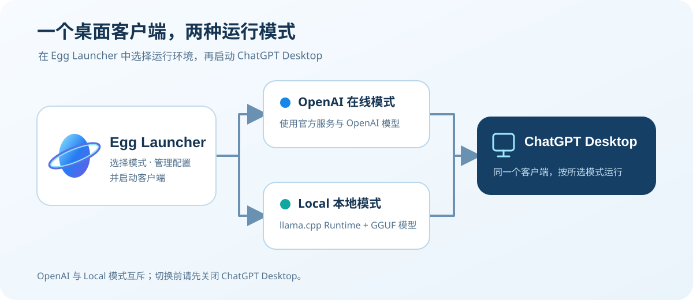

# Egg Launcher

> 一款 Windows x64 启动器，让你在同一个 ChatGPT Desktop 中切换 OpenAI 在线模式与本地 llama.cpp 模式。
>
> A Windows x64 launcher for switching between OpenAI and local llama.cpp modes in ChatGPT Desktop.

**[下载 v0.9.7（Windows x64）](https://github.com/jiazong-hub/Egg-Launcher/releases/download/v0.9.7/Egg-Launcher-0.9.7-Setup-win-x64.exe)** · [发布说明与全部文件](https://github.com/jiazong-hub/Egg-Launcher/releases/tag/v0.9.7) · [SHA-256 校验文件](https://github.com/jiazong-hub/Egg-Launcher/releases/download/v0.9.7/Egg-Launcher-0.9.7-Setup-win-x64.exe.sha256) · [用户指南](docs/user-guide.md)



**当前测试范围（2026-10-10 更新）：**用户确认当前 0.9.7 正式包的全新安装、覆盖升级、卸载恢复均已通过实测；Windows 10 下 CUDA、Vulkan、CPU 后端均已测试，运行比较稳定；思考档位调节、思考过程显示和工具执行均已通过测试。Windows 11、ROCm 尚未测试。上述结论对应已测试环境与模型，不代表所有组合均已通过。安装包使用项目自签名证书，首次运行可能出现 Windows 安全提示，详见[签名策略与证书指纹](docs/signing-policy.md)。

开发者：甲总不是贾总 · [MIT License](LICENSE)

模型推理由 llama.cpp 负责；Egg Launcher 管理路径、配置、模式切换、进程协调与安全边界，不读取或替换账户凭据。模型在线下载仍为实验性功能。

## 当前发布状态

- **0.9.7 于 2026-10-07 发布。** 新增 SSE 等待时间调节，改进思考档位验证与设置，并修复配套 CLI 定位及检测异常处理。见[发布说明](docs/release-notes-0.9.7.md)及[检查记录](docs/release-checks-0.9.7.md)。[旧版 0.9.5](https://github.com/jiazong-hub/Egg-Launcher/releases/tag/v0.9.5)保留供回退。

- 当前 0.9.7 正式包全新安装、覆盖升级、卸载恢复已由用户实测通过；思考档位调节、思考过程显示和工具执行也已测试通过。最新确认记录见[0.9.7 检查记录](docs/release-checks-0.9.7.md)。
- Windows 10 下 CUDA、Vulkan、CPU 后端均已测试，运行比较稳定；Windows 11、ROCm 尚未测试。建议通过 Egg Launcher 切换模式并启动客户端，绕过启动器可能造成客户端接口状态不同步。
- 安装包使用项目自签名代码签名证书，不属于 Windows 公共信任证书；首次下载运行可能出现安全提示。请核对[签名策略与证书指纹](docs/signing-policy.md)。

- 版本：`v0.9.2` 本地标签；沙箱设置仍为 beta。该标签封存时未完成自动化测试和完整沙箱真机验收。2026-09-25 的后续工作树已修正两项与跨模式历史查阅需求冲突的旧测试断言，249 项自动化测试与 Release 构建通过；完整真机验收仍未完成，不能将此标签理解为公开发布门禁已通过。
- 当前真机结论：Windows 10 下 CUDA、Vulkan、CPU 后端已有稳定性实测反馈；Local 推理和自动压缩已有连续通过记录，切回 OpenAI 后官方账户、模型和权限配置可恢复。
- 模型管理：新模型只在首次添加时识别 Dense/MoE；类型未知时要求用户指定。MTP、视觉和思考能力按模型保存。参数页“思考设置”使用实际模板验证原生思考开关、独立档位和 Responses 传递，只提供确认档位，不补齐或映射；检测结果保存才应用。
- 界面状态：支持深色/浅色主题、中英文及跟随系统语言、托盘菜单与按需状态提示；主窗口后台或最小化时停止无意义的高频状态探测。
- 跨设备边界：Runtime 与模型路径可重新扫描；Windows 10 下 Vulkan 已测试且比较稳定，其他模型、驱动和设备组合仍需分别验证；Windows 11、ROCm 尚未测试。
- 客户端边界：Local 模式复用已安装的 ChatGPT Desktop；如果客户端自身强制要求登录，Launcher 不绕过该要求。
- 实验边界：公开 GGUF 搜索可用；下载结果受 llama.cpp 构建、网络、代理、TLS 和 Hugging Face 可访问性影响。

使用与发布资料：

- [用户功能说明](docs/user-guide.md)
- [0.9.1 公测版发布说明](docs/release-notes-0.9.1.md)
- [0.9.2 本地版本说明](docs/release-notes-0.9.2.md)
- [0.9.3 安装版开发说明](docs/release-notes-0.9.3.md)
- [0.9.4 公开测试版说明](docs/release-notes-0.9.4.md)
- [0.9.4 正式发布检查记录](docs/release-checks-0.9.4.md)
- [0.9.5 发布说明](docs/release-notes-0.9.5.md)
- [0.9.5 正式发布检查记录](docs/release-checks-0.9.5.md)
- [0.9.6 发布说明](docs/release-notes-0.9.6.md)
- [0.9.6 正式发布检查记录](docs/release-checks-0.9.6.md)
- [0.9.7 发布说明](docs/release-notes-0.9.7.md)
- [0.9.7 正式发布检查记录](docs/release-checks-0.9.7.md)
- [真机验收清单](docs/manual-acceptance-checklist.md)
- [v0.9.1 已封存安全复核（0.9.2 尚待完整验收）](docs/release-security-review-0.9.1.md)
- [变更记录](CHANGELOG.md)
- [架构决策 0003：按模型管理 Codex 沙箱权限](docs/architecture/0003-per-model-codex-sandbox.md)
- [架构决策 0004：跨 Provider 历史查阅与续聊边界](docs/architecture/0004-cross-provider-history-boundary.md)

## 产品边界

- OpenAI 与 Local 模式互斥，切换前必须关闭 ChatGPT Desktop。
- 关闭客户端不会切换模式；上次模式和本地模型会保留。
- 切换本地模型不需要先回到 OpenAI；客户端关闭后可直接执行 Local A→B 事务。
- 两种模式共享项目和任务历史，可跨模式查阅；远端访问端点和模型列表隔离。旧任务在另一 Provider 下继续发送消息不属于 0.9.2 支持范围。
- Local 模式由后台 Agent、回环安全代理与 llama.cpp Router 支持直接启动 ChatGPT Desktop；为了共享原生项目和历史，Codex 会保留官方账户外壳（包括左下角账户名称），但只加载 local-only 模型 Catalog。这不是一个独立的“本地账户登录”。本地 Provider 复用现有登录状态但使用独立 Provider 身份，使 Codex 选择自己的本地语义压缩，而不是向 llama.cpp 发送 OpenAI 专用 compaction item。
- 安全代理只公开必需的 Responses、模型清单和健康检查路由，拒绝浏览器 Origin 和管理接口；它剥离官方认证、Cookie 和账户元数据，除传输解压、已验证的思考参数适配及用户开启的思考显示兼容处理外，透明转发对话与模型响应。显示兼容处理保留原始思考，增加 Desktop 使用的展示副本，并在后续输入中清除完全重复的副本。Agent 为私有 llama 管理端点生成随机 API key，状态文件只保存当前 Windows 用户可解开的 DPAPI 密文。
- 每个模型保存独立的“压缩安全余量”，Launcher 只把 `Context - 压缩安全余量` 写成 Codex 的原生自动压缩线。该余量不是单次输出 token 限制；Codex 仍负责判断安全节点、请求当前模型生成摘要并重建历史，Launcher 不生成摘要，也不保存第二套对话。代理只记录 `turn/compaction`、输入项类型和协议形态等无正文诊断。
- Context、压缩安全余量、KV Cache、GPU Offload 等参数最终由用户按模型决定；可选的“由 llama 自动适配”直接调用同一 Runtime 的 `llama-fit-params`，先展示结果、经确认后才应用，且不会覆盖其他模型。Launcher 不提供硬件无关的内置推荐。Local 模式下，当前配置模型在客户端、后台 Agent 或当前 Runtime 的 llama 服务任一运行时禁止编辑参数；服务完全停止后允许编辑，其他可用模型仍可编辑。自动适配要求先切回 OpenAI，并停止当前 Runtime 的 llama 服务。保存事务更新该模型的 Profile 与 BAT；若它是当前配置的 Local 模型，还立即同步 Catalog、Router preset，以及 Codex 的上下文、压缩线、工具输出预算、SSE 等待时间和沙箱设置及恢复记录；配置更新失败时回滚模型文件。保存不启动或重载服务；下次冷启动重新读取已保存 Profile。非当前模型只保存自身配置，切换到它时再应用 Codex 配置。SSE 空闲等待时间按模型保存，以 5 分钟为步进，可沿用 Codex 默认，切回在线后使用原有配置。
- Context 低于 16K 时，参数窗口、模型列表和 Local 启动确认会显示非阻断风险提醒；用户仍可保存、生成 BAT 和启动。Launcher 不自动提高 Context，也不改变用户设置的压缩安全余量。
- 参数文件只校验缓存类型等原生参数的安全格式，不用固定枚举阻止未来 llama.cpp 新增的合法值；最终支持性与错误信息仍由所选 Runtime 决定。
- 主窗口位于前台时以低频率刷新运行状态；最小化、隐藏到托盘或退出过程中停止周期探测。进入模型管理、打开托盘菜单或请求托盘状态时按需刷新一次，避免重复昂贵检测。本地模型页的嵌套列表在到达自身滚动边界后会继续滚动整个页面。
- 审批方式仍由 ChatGPT Desktop 的原生控件管理，Launcher 不修改 `approval_policy` 或 `approvals_reviewer`。如用户为某个模型保存了沙箱设置，Launcher 会在 Local 切换事务中应用该模型的命名权限配置，并在切换模型或回到 OpenAI 时恢复对应基线；未设置沙箱的旧模型不改变现有 Codex 沙箱配置。
- 配置切换使用模式级与配置级跨进程锁、提交前文件版本校验和可恢复事务；原官方配置按当前 Windows 用户使用 DPAPI 加密备份。启动时会收敛中断事务，受管字段冲突或 `config.toml` 在读取后被外部改写时停止而不是覆盖。
- Launcher 与 Agent 均为单实例；Agent 通过 Windows Job Object 约束自有 llama-server 进程树，异常退出时不会遗留模型进程长期占用显存。
- Profile 默认启用 llama.cpp 原生 `--sleep-idle-seconds 300`：空闲五分钟后由 llama.cpp 卸载模型与 KV Cache，新请求自动重新加载；Agent 不再监视客户端关闭并代替 Runtime 卸载模型。
- 每个模型可把当前参数保存为自身的专用默认快照；只有已经保存快照的模型才能执行“恢复此模型默认”，其他模型不会继承或改变。
- **实验性功能**：本地模型页可搜索 Hugging Face 的公开 GGUF 元数据并选择量化版本；下载、缓存、分片和取消由临时 llama.cpp Router 原生执行，Launcher 只显示它返回的字节进度、百分比与换算速度。下载服务只监听随机回环端口、使用一次性 API key、禁用模型自动加载，并在任务结束后退出。Launcher 不实现下载器，也不支持私有 / gated 模型。该功能可能受 Runtime 构建和网络环境影响，失败不会影响核心切换与本地推理。
- 下载窗口会显示“连接状态流、请求已接受、传输、核对缓存路径”等原生阶段。llama 长时间不返回当前模型的 SSE 状态时会安全超时，不再无限停留在 0%；DNS、TLS、HTTPS 构建或连接失败只从本次临时 Router 日志映射为有限诊断。只有 llama `/models` 返回位于 Runtime `models` 目录内的真实文件路径才算成功。
- “运行与缓存”页显示 Windows CPU/RAM、当前 Runtime 的 llama 进程资源和驱动公开的 GPU/Compute/显存计数，并从 llama 原生 `/models`、`/metrics`、`/slots` 显示模型状态、请求、速度、KV 与实际 Slot token。不可用数据明确标注，不用估算值冒充实测值。
- 当前 Local 模型可通过 llama 原生 `/models/load` 立即加载、通过 `/models/unload` 立即释放。监控不会为了取数唤醒已经休眠的模型。
- 缓存删除由临时 llama Router 的 `DELETE /models` 完成。只有新版下载记录与 llama 原生 `can_remove` 同时确认的缓存才显示；Local 模式、正在运行的 Runtime、手动 GGUF 和来源不明的旧 Profile 都禁止删除。
- 已管理模型可查看来源、路径、大小、分片、参数、专用默认值以及 llama 在已运行时返回的架构/参数量/训练上下文/模态信息。性能基准测试不在当前版本范围内。
- 已管理模型按 `Dense`、`MoE` 或未指定类型区分；变更类型会重建该模型参数配置，防止不同结构复用不兼容参数。模型文件被用户从磁盘移走后条目会变灰；“从列表中移除”只删除 Launcher Profile 与受管生成物，不删除模型数据。
- MTP 与视觉模块支持内置能力标识和外置 GGUF/mmproj 的显式关联、隔离验证、取消关联与失效检测；能力标识不等同于已启用。所有未调整参数继续使用 llama.cpp 默认值。
- 若 GGUF 内置 Qwen Chat Template 含有已知的严格系统消息守卫，Launcher 从该模型自身的元数据生成独立兼容模板，并只通过 llama.cpp 原生 `--chat-template-file` 加载。请求正文仍透明转发，Launcher 不承担对话协议转换。
- 关闭 Launcher 时，OpenAI 模式会正常结束无用 Agent；Local 模式可选择只关闭窗口并保留服务，或停止回环代理、llama.cpp Router 与 Agent 后完整退出。完整退出不切换持久化模式。
- App 会校验后台 Agent 的协议版本、PID、程序路径、进程启动时间和状态心跳，拒绝把新版界面和旧版 Agent 混用；无法确认归属的同名进程绝不会被强制结束。
- llama.cpp 上游使用随机回环端口；若启动与绑定之间发生端口竞态，Agent 只对明确的地址占用错误换端口重试，模型或参数错误不会被掩盖。Desktop-facing 回环端口首次切换时随机生成并持久化；若以后被占用，只有在 ChatGPT Desktop 已关闭时才会通过配置事务迁移，绝不结束未知占用进程。App 只连接 Agent 状态中经过身份与心跳校验的实际端点。
- 便携版可由用户在首页启用当前用户的 Windows 登录启动项；程序不会在未确认时自行注册。
- 切回 OpenAI 时恢复进入 Local 前的模型、思考强度、摘要/详细程度、服务层级、上下文设置以及权限字段，并保留官方账户、工作区、项目和历史。为查阅旧 Local 对话，配置保留未激活、不能处理请求的本地历史 Provider 定义；因此恢复后的 `config.toml` 不要求与切换前逐字相同。原任务跨 Provider 续聊的第二阶段已放弃，不在此版本实现。

完整需求见 [ChatGPT_Launcher_OpenSource_PRD.md](ChatGPT_Launcher_OpenSource_PRD.md)。

## 开发环境

- Windows 10 22H2 x64（Build 19045）或 Windows 11 x64
- .NET 10 SDK

仓库可使用项目内 SDK：

```powershell
& '.\.tools\dotnet\dotnet.exe' build '.\ChatGPTLocalLauncher.sln'
& '.\.tools\dotnet\dotnet.exe' test '.\ChatGPTLocalLauncher.sln'
```

生成 Windows x64 便携验收包：

```powershell
& '.\scripts\Publish-Portable.ps1'
& '.\scripts\Publish-Portable.ps1' -SelfContained -Archive
```

生成 Windows x64 单文件 EXE 安装包（当前用户安装）：

```powershell
& '.\scripts\Publish-Installer.ps1' -IsccPath 'C:\Program Files (x86)\Inno Setup 6\ISCC.exe'
```

编译器须安装 Inno Setup 6.5 或更新版本；简体中文语言文件已随项目放在 `installer/ChineseSimplified.isl`（来源：Inno Setup 官方翻译仓库）。脚本复用便携发布门禁，先生成自包含内部目录，再编译安装包与 `.sha256` 文件。没有签名参数时仅供内部验收，不作为公开发布包。正式签名需要 PowerShell 7（`pwsh.exe` 位于 PATH），并传入 `-RequireSignature -SigningCertificateThumbprint '证书指纹'`；若使用自签名证书，另加 `-AllowUntrustedSelfSignedCertificate`。可选传入 `-SignToolPath` 和 `-TimestampUrl`，安装包与卸载程序由同一签名命令签署。

安装器默认使用当前用户的程序目录，不要求管理员权限；不自动启用登录启动，不安装 llama.cpp、模型或 ChatGPT Desktop。升级前应正常退出启动器和 Agent。卸载确认后会先检查 ChatGPT Desktop 是否已关闭，并在必要时通过现有事务恢复 OpenAI 配置；失败会停止卸载。旧 Local 任务所需的未激活历史 Provider、`%LOCALAPPDATA%\ChatGPTLocalLauncher` 数据、模型和 Runtime 目录仍保留。旧便携版文件不会被自动删除。

使用已安装在当前用户证书存储中的可信代码签名证书发布：

```powershell
& '.\scripts\Publish-Portable.ps1' -SelfContained -Archive -RequireSignature `
    -SigningCertificateThumbprint '证书指纹' `
    -SignToolPath 'C:\Program Files (x86)\Windows Kits\10\bin\<版本>\x64\signtool.exe' `
    -TimestampUrl 'https://你的时间戳服务地址'
```

开源项目使用自签名作者证书发布时可省略 `SignToolPath`，直接使用 Windows PowerShell Authenticode：

```powershell
& '.\scripts\Publish-Portable.ps1' -SelfContained -Archive -RequireSignature `
    -AllowUntrustedSelfSignedCertificate `
    -SigningCertificateThumbprint '证书指纹'
```

首次证书初始化使用 `scripts\Initialize-SelfSignedCodeSigning.ps1`，并把 PFX 私钥备份到源码目录之外。自签名可以省略外部时间戳；证书过期后需要使用同一私钥续签或重新签署发布文件。自签名只证明持有同一私钥的作者身份连续性和签名后文件完整性；项目应在官方源码及发布页面长期公开证书指纹，不能把它描述为第三方身份认证或 Windows 公共信任。

签名在生成哈希清单和 ZIP 之前执行；脚本会逐个验证 Launcher 自有 EXE/DLL 的 Authenticode 签名。未提供签名参数时仍可生成内部验收包，但 `BUILD-INFO.txt` 会明确记录 `Signature=unsigned`；正式对外公测应使用 `-RequireSignature`，缺少任一签名条件都会拒绝发布。

发布脚本使用锁定依赖，依次执行 Release 警告门禁、格式检查、全部测试、在线依赖漏洞审计和发布后 Agent 自检。默认生成带 UTC 时间戳的新目录，不覆盖旧包；ZIP 会解压并逐文件比对哈希。只有明确的离线验收才可使用 `-SkipDependencyAudit`，该状态会写入 `BUILD-INFO.txt`。

真实客户端验收必须安排在可以完全关闭 ChatGPT Desktop 的时间，按 [真机验收清单](docs/manual-acceptance-checklist.md) 执行。

不要根据固定文件名判断哪个包最新；每次发布都会生成新的版本化目录和 ZIP。同目录 `.sha256` 文件用于校验整个下载包，包内 `BUILD-INFO.txt` 和 `SHA256SUMS.txt` 分别记录源码摘要、门禁结果及逐文件哈希。真实 Desktop Local 请求仍需真机复测。

隔离 Smoke Test（会加载 `D:\llama.cpp\models` 中识别到的第一个主模型）：

```powershell
& '.\.tools\dotnet\dotnet.exe' run --project '.\src\Launcher.Agent\Launcher.Agent.csproj' -- --smoke-codex 'D:\llama.cpp' --once
& '.\.tools\dotnet\dotnet.exe' run --project '.\src\Launcher.Agent\Launcher.Agent.csproj' -- --smoke-codex-tools 'D:\llama.cpp' --once
& '.\.tools\dotnet\dotnet.exe' run --project '.\src\Launcher.Agent\Launcher.Agent.csproj' -- --smoke-codex-compaction 'D:\llama.cpp' --once
```

第一条验证 Codex 文本端到端链路；第二条是严格工具门，分别报告工具调用次数、成功次数和策略拒绝次数。策略拒绝表示测试环境未授权，不能误报为 llama.cpp 连接故障；只有 JSONL 中出现成功的命令执行事件才通过。第三条只降低本次测试的阈值，验证 Codex 通过普通 `/responses` 摘要轮次完成本地自动压缩，且没有误走 llama.cpp 不支持的远程压缩协议。

## 项目结构

- `Launcher.App`：WPF 图形界面
- `Launcher.Agent`：Local 会话的后台协调进程及卸载准备入口
- `Launcher.Core`：设置、状态与持久化
- `Launcher.Runtime`：llama.cpp Runtime / Router 能力探测、进程管理与回环安全代理
- `Launcher.Models`：GGUF 扫描、公开模型目录元数据与 Profile
- `Launcher.Scripts`：BAT 与 Router preset 生成
- `Launcher.ChatGPT`：ChatGPT Desktop 集成、备份与恢复边界
- `Launcher.Orchestration`：模式切换事务与后台 Router 监督
- `Launcher.Tests`：自动化测试
- `docs/user-guide.md`：页面、按钮、参数、状态与对话框说明
- `docs/release-notes-0.9.1.md`：v0.9.1 公测版封存说明
- `docs/release-notes-0.9.2.md`：v0.9.2 本地版本范围和已知限制
- `installer/EggLauncher.iss`：EXE 安装与卸载脚本
- `scripts/Publish-Installer.ps1`：安装包发布门禁与签名编译入口
- `docs/research`：历史探索记录，不作为当前实现规范

## 安全原则

不读取或复制 `auth.json` 内容；不整目录覆盖 `.codex`；不按进程名批量终止 llama-server；不在代理中实现模型能力或改写对话语义；所有真实 Provider 切换都要求客户端已关闭并由用户明确确认。登录启动只接受不允许普通用户组修改的 Launcher 程序位置。启动 llama 子进程前会移除常见云端 API key/token 环境变量；原生 stdout/stderr 日志每段上限为 16 MiB，停止后保留至多 10 个文件，但其内容由 llama.cpp 决定，排障后应按需清理。自动化构建与封存不会修改用户的真实 ChatGPT Provider；真实模式切换由用户按验收清单执行。

当前实现边界见 [架构决策 0002：Launcher 保持为 llama.cpp 的薄管理壳](docs/architecture/0002-thin-launcher-boundary.md)。`docs/research` 中的早期实测记录仅用于追溯，里面已经废弃的兼容代理方案不是当前实现依据，也不会放入发布包。


## v0.9.7 同版本更新：思考设置（2026-10-09）

依据当前源码，思考设置依次为“检测思考能力”“启用思考”“调节思考强度”，在原有内容容器内使用两条分割线分隔。检测区域包含实际模板状态、检测入口、已确认档位和详情，不再单独显示默认档位。

“默认思考强度”位于调节区域，只列出当前模型已验证的原始档位及“沿用模型默认”。按模型保存 PreferredReasoningLevel，不覆盖检测出的 DefaultReasoningLevel；配置和模型目录共用同一选择逻辑。仅在档位验证、Responses 传递及客户端兼容性通过、允许调节开启时传递；不再以启用思考为统一前提。用户选择无效时回退有效的模型默认，不补齐或映射档位。反转只改变排列，不改变默认值或请求值。新对话使用该默认，已有对话可能保留自身选择。关闭调节、不可用或检测中，下拉框置灰并保留偏好。

“显示思考过程”默认关闭，位于“启用思考”下方；思考关闭、能力未确认或检测中时置灰并保留偏好。代理保留原始思考并通过 Desktop 的 summary 通道提供全文展示，不生成另一份摘要；原生摘要保留。后续输入仅清理完全相同的展示副本。show_raw_agent_reasoning 纳入配置恢复事务，切回在线恢复原值或原本缺省状态。显示及默认强度偏好不使已有能力验证失效。

实现与验证详见 [思考显示审查](docs/thinking-display-review-20261007.md)和[默认强度审查](docs/reasoning-default-review-20261007.md)。本次保持版本 0.9.7，不修改更新日志。

## v0.9.7 同版本修复：思考验证关联（2026-10-07）

思考能力没有按时间失效机制。修改 fit 显存余量、线程数、设备分配、加载和计算优化等已明确独立的资源参数，不再使思考验证失效；这些参数的原有范围校验及运行中编辑限制仍保留。RoPE、YaRN、SWA、思考覆盖和未知额外参数仍参与检查，模型、实际模板/Jinja、llama.cpp 可执行文件与 DLL、Desktop 配套 CLI 的验证依据检查也保留。

指纹规则升级为 5，Profile schema 保持 13。准确匹配的 v4 结果在编辑或自动适配修改参数前迁移，保留能力结果和检测时间，取消编辑不落盘。已经失效或已被清除的结果不能自动恢复。新增可选组件摘要用于说明具体变化；旧记录没有变化项时如实提示，文件读取失败单独报告。

“显示思考过程”的偏好本身不会阻止其他参数保存。真实验证依据变化时清理能力并同步禁用实际显示，保留显示、默认强度及反转等用户偏好；显式思考开关、档位调节及有效开启的显示仍按当前验证结果检查。当前本地模型的保存继续使用既有配置事务，其他模型不覆盖当前配置，切回在线仍恢复原配置。

完整排除项、迁移规则及运行参数审查见[思考验证关联审查](docs/reasoning-validation-scope-review-20261007.md)。


## 思考模块独立性与确认操作（2026-10-09）

启用思考和调节思考强度不再相互联动。开关能力与档位能力分别验证；档位还要求 Responses 传递和客户端兼容性确认。检测中或对应能力未确认时仍禁用相关设置，不针对特定模型硬编码联动。

模块内部约束保持：显示思考过程要求有效开启思考；反转顺序和默认强度要求档位调节开启。禁用时保留偏好。关闭思考仍传递原有 false、reasoning off 和预算 0；已开放的真实档位及有效默认值继续提供给 Codex，不映射、不改名。Codex 可选择档位不代表模型在关闭思考时一定应用该档位。

已确认思考关闭时，开启档位调节、操作反转或默认强度前提示部分模型需要启用思考才能应用档位。关闭档位调节不提示。默认选择否；选择否在控件变化前取消操作，值、颜色、滑块位置和默认选项保持原样。选择是后继续，同一编辑窗口不重复提示；重开窗口重新判断。初始化、刷新、默认状态未知或没有思考开关的模型不误报关闭。

实现及验证见[思考模块与确认操作审查](docs/thinking-independent-review-20261008.md)。版本保持 0.9.7，更新日志及四条发布说明不变。
